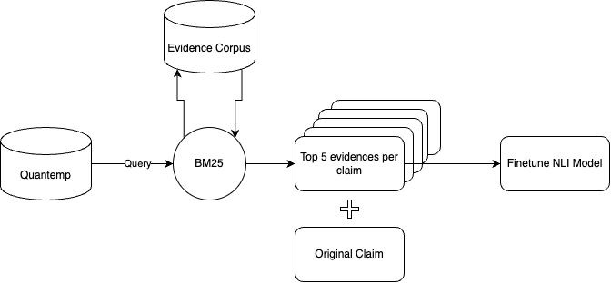
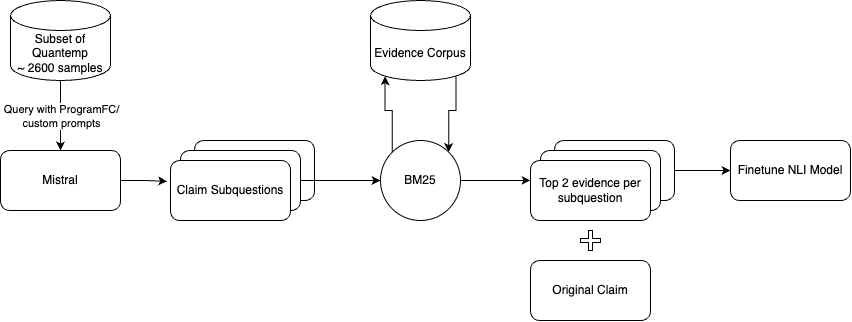

# NLP Project: Verification Study with NLI Models

## Introduction
This project focuses on the verification of claims using the QuanTemp dataset, consisting of 15,000 claims and 420,000 evidence snippets. The repository hosts code for training natural language inference (NLI) models and various scripts for evaluating these models on numerical handling and claim decomposition tasks.

# Project Overview
Here is an overview of the project workflow:


and the Mistral pipeline:



## Project Structure
- **NLI Train Models**: Scripts and notebooks related to training the NLI models.
- **Evaluation**:
  - **BM25**: Evaluation scripts using BM25 for evidence retrieval.
  - **Oracle**: Evaluation scripts using Oracle evidence.
- **Numerical Handling**:
  - **PASTA**: Scripts handling numerical data using the PASTA method.
  - **ELASTIC**: Scripts for numerical data handling using ELASTIC.
- **Claim Decomposition**:
  - **ProgramFC**: Scripts for claim decomposition using the ProgramFC approach.
  - **Custom Models**: Custom model scripts for claim decomposition.

## Workflow Overview
1. **Start**: Initiate the project by exploring the QuanTemp dataset, which involves claims and their corresponding evidence snippets.
2. **Train NLI Models**: The core of this project, focusing on training models to handle the inference based on natural language processing.
3. **Evaluation**: Evaluate the trained models using:
   - Oracle Evidence
   - Top-k BM25 Evidence
4. **Numerical Handling**: Integrate numerical data handling within the evaluation process using PASTA and ELASTIC methods.
5. **Claim Decomposition**: Decompose claims using either ProgramFC or custom methods tailored for specific requirements.
6. **Evaluate**: Systematically evaluate model performance across different claim types.
7. **Metrics**: Assess the models using various performance metrics.

## Installation & Usage
Clone the repository and navigate to the project directory:
```bash
git clone [URL-to-your-repository]
cd [repository-name]
```
To run a specific script or notebook, use:
```bash
jupyter notebook [notebook-name.ipynb]
# or
python [script-name.py]
```
